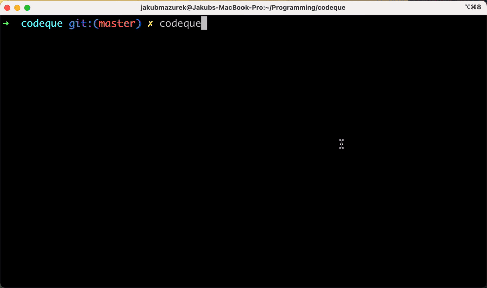

<p align="center">
  <a href="https://codeque.co/?utm_source=readme_main" title="Learn more about CodeQue" target="_blank">
    
  </a>
  <br/>
  </p>
<p align="center">
  <a href="https://codeque.co/?utm_source=readme_main">Website</a>&nbsp;&nbsp;•&nbsp;&nbsp;  
  <a href="https://codeque.co/docs?utm_source=readme_main">Docs </a>&nbsp;&nbsp;•&nbsp;&nbsp; 
  <a href="https://codeque.co/roadmap?utm_source=readme_main">Roadmap</a>&nbsp;&nbsp;•&nbsp;&nbsp; 
  <a href="https://codeque.co/mission?utm_source=readme_main">Mission</a>&nbsp;&nbsp;•&nbsp;&nbsp; 
  <a href="https://codeque.co/playground?utm_source=readme_main"><b>Playground</b></a>
</p>

<p align="center">Find and lint complex code patterns effortlessly</p>

___ 

# What is CodeQue?

CodeQue is semantic code search engine that understands the code syntax. 

It matches code structurally which makes it excellent for more complex queries.

Query language offers wildcards, partial matching and ignores code formatting. 

Structural code search is available for JavaScript, TypesScript, HTML, CSS, Python, Lua and more soon.

Text code search with handy wildcards is available for __every language__ and covers common regex search use cases.

<p align="center"><a href="https://codeque.co/playground?utm_source=readme_main"><b>Give it a try in 
 playground</b></a></p>

<p align="center"><i>Just paste code snippet to start searching, no installation needed!</i></p>

__Integrations__

CodeQue is available as:

- [VSCode extension](https://marketplace.visualstudio.com/items?itemName=CodeQue.codeque) for delightful code search and navigation experience.
- [ESLint integration](https://www.npmjs.com/package/@codeque/eslint-plugin) for creating custom linting rules in zero time.
- [CLI tool](https://www.npmjs.com/package/@codeque/cli) for searching code and more including headless environments.

<p align="center"><i>All CodeQue tools <b>work offline</b> hence code never leaves your local environment.</i></p>

__Coming soon__

CodeQue will be soon available as:

- Duplicated code identification
- Batch code refactoring 
- Advanced ESLint rule creator 


<p align="center"><a href="https://jayu.dev/newsletter?utm_source=readme_main"><b>🔔 Get notified about updates 🔔 </b></a></p>


</br>

<!-- HERO END -->
  
<!-- VSCODE INTRO START -->
## Visual Studio Code Extension 🔮
VScode extension aims to make your workflow more efficient.

It addresses the problems of standard search by providing multiline support and offers an easy way to add gaps or use wildcards in the query. 

You don't need to have any Regex knowledge to query complex code patterns. 

With CodeQue, you can easily navigate and modify your codebase, making your development process faster and more efficient.

It will help you with code refactoring, speed up project discovery, and make it easy to find duplicated or similar code patterns. 

Advanced code search options and todo-like list of accurate search results will streamline your workflow.

</br>

<p align="center"><b>Watch extension in action in 1 minute (external link) 👇</b></p>

<a href="https://codeque.co/vscode-demo-sound.mp4?utm_source=readme_main" target="_blank" title="Click to watch demo video">
    
</a>

</br>

<!-- VSCODE INTRO END -->

</br>

<p align="center"><a href="https://marketplace.visualstudio.com/items?itemName=CodeQue.codeque"><b>Get extension from marketplace</b></a></p>
  
<!-- ESLINT INTRO START -->
## ESLint integration 💅

Using CodeQue ESLint plugin you can create your own custom linting rules in zero time.

Custom ESLint rules can help execute on long-term refactors or prevent introducing codebase specific bugs or bad patterns.

Rules can replace your decision log and help standardizing coding conventions across the project or organization.

CodeQue ESLint integration is a no-brainier for any team willing to improve their codebase quality.

<!-- ESLINT INTRO END -->

__Installation 👇__

```sh
yarn add --dev @codeque/eslint-plugin
```


__Usage ✨__

Enhance your `.eslintrc` with following setup:

```json
{
  "plugins": ["@codeque"],
  "rules": {
    "@codeque/error": ["error", [
      {
        "query": "fetchData()",
        "mode": "exact",
        "message": "Using fetchData() without parameters causes app crash!",
      },
    ]],
    "@codeque/warning": ["warn", [
      {
        "query": "import $$$ from 'lodash';",
        "mode": "include",
        "message": "Prefer to import lodash functions from separate packages like 'lodash.debounce'",
      },
    ]]
  }
}
```
Find more information in [`@codeque/eslint-plugin` package readme](https://www.npmjs.com/package/@codeque/eslint-plugin)


</br>

<p align="center">

</p>

</br>
  
<!-- CLI INTRO START -->
## CLI tool 🔥

CodeQue CLI is a complementary tool that can be used for
- Searching code patterns right from terminal including headless environments
- Building scripts to assert that some code patterns exist or not exist
- Enhancing git hooks to avoid committing or pushing unwanted code

<!-- CLI INTRO END -->

__Installation 👇__

```sh
yarn global add @codeque/cli
```

__Usage ✨__

```sh
codeque
```

</br>

<p align="center"><p>

</br>

Find more information in [`@codeque/cli` package readme](https://www.npmjs.com/package/@codeque/cli)

<!-- FOOTER START -->

## Support and feedback

Feel free to use [Github Issues](https://github.com/codeque-co/codeque/issues)
to
- ask for help with writing a query
- report a bug or doubt
- suggest feature or improvement